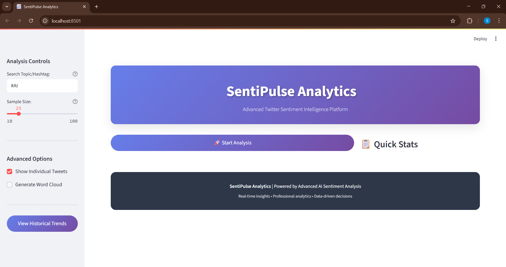
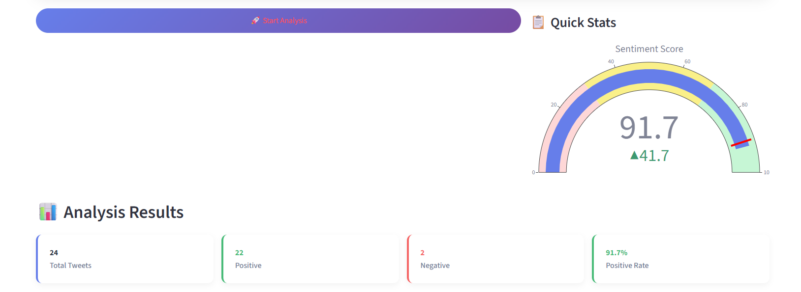
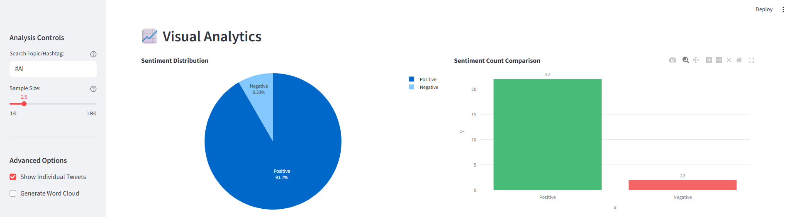
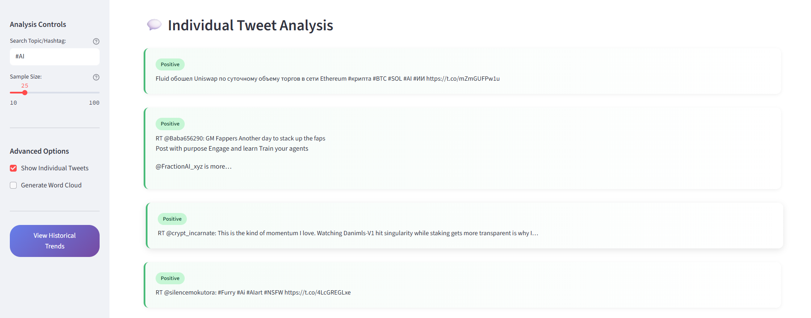

# 📊 SentiPulse Analytics - Advanced Twitter Sentiment Intelligence Platform

*Real-time Twitter sentiment analysis with professional-grade visualizations and analytics*



**SentiPulse Analytics** is a sophisticated real-time Twitter sentiment analysis platform built with **Streamlit**, **Tweepy**, and **Scikit-learn**. It provides comprehensive sentiment intelligence through advanced NLP models, interactive visualizations, and professional analytics dashboards.

[](your-deployed-app-link)
[](https://www.python.org/downloads/)
[](https://opensource.org/licenses/MIT)

---

## ✨ Key Features

### 🎯 **Core Analytics**
- 🔍 **Smart Search**: Analyze tweets by topic, hashtag, or keywords
- 🧠 **Advanced NLP**: LinearSVC + TF-IDF sentiment classification
- 📊 **Real-time Processing**: Instant analysis of up to 100 tweets
- 🎛️ **Interactive Controls**: Customizable sample sizes and analysis options

### 📈 **Professional Visualizations**
- 📉 **Sentiment Score Gauge**: Visual sentiment strength indicator
- 🥧 **Distribution Charts**: Pie and bar charts for sentiment breakdown
- 📋 **Detailed Data Tables**: Comprehensive results with confidence scores
- 🔍 **Individual Tweet Analysis**: Card-based tweet examination

### 📱 **Modern Interface**
- 🎨 **Professional Design**: Modern gradient UI with smooth animations
- 📱 **Responsive Layout**: Optimized for desktop and mobile viewing
- ⚡ **Fast Performance**: Efficient data processing and visualization
- 🌙 **Elegant Styling**: Custom CSS with hover effects and transitions

### 📊 **Data Intelligence**
- 💾 **Historical Tracking**: Automatic logging of sentiment trends
- 📈 **Trend Analysis**: Historical sentiment visualization
- 📄 **Export Capabilities**: CSV data export for further analysis
- 🔒 **Secure Configuration**: Environment-based API management

---

## 🖼️ Screenshots

### 1. Analysis Results

*Comprehensive sentiment metrics with professional metric cards showing total tweets, positive/negative counts, and sentiment scores*

### 2. Visual Analytics

*Interactive charts including sentiment distribution pie charts, comparison bar graphs, and real-time sentiment gauge*

### 3. Detailed Results

*Structured data table with tweet content, sentiment labels, and confidence scores for comprehensive analysis*

### 4. Individual Tweet Analysis

*Card-based individual tweet display with sentiment badges and hover effects for detailed examination*

---

## 🏗️ Project Architecture

```
SentiPulse-Analytics/
├── 📱 app.py                    # Main Streamlit application
├── ⚙️ config.py                 # Twitter API configuration
├── 📋 requirements.txt          # Project dependencies
├── 🔐 .env                      # API credentials (secure)
├── 📊 logs/
│   └── 📄 sentiment_log.csv     # Historical sentiment data
├── 🧠 src/
│   ├── 🔄 fetch.py             # Tweet fetching with Tweepy
│   └── 🎯 predict.py           # Sentiment prediction engine
├── 📸 screenshots/              # Demo screenshots
│   ├── dashboard-overview.png
│   ├── analysis-results.png
│   ├── visual-analytics.png
│   ├── detailed-results.png
│   └── individual-tweet-analysis.png
└── 📖 README.md
```

---

## 🚀 Quick Start Guide

### 1️⃣ **Clone Repository**
```bash
git clone https://github.com/yourusername/sentipulse-analytics.git
cd sentipulse-analytics
```

### 2️⃣ **Install Dependencies**
```bash
pip install -r requirements.txt
```

### 3️⃣ **Configure Twitter API**
Create a `.env` file in the root directory:
```env
BEARER_TOKEN=your_twitter_bearer_token_here
API_KEY=your_api_key
API_SECRET=your_api_secret
ACCESS_TOKEN=your_access_token
ACCESS_TOKEN_SECRET=your_access_token_secret
```

### 4️⃣ **Launch Application**
```bash
streamlit run app.py
```

### 5️⃣ **Access Dashboard**
Open your browser to `http://localhost:8501`

---

## 🌐 Live Demo

🔗 **[Try SentiPulse Analytics Live](your-deployed-streamlit-app-url)**

*Experience real-time sentiment analysis with our deployed Streamlit application*

---

## 🔧 Technical Specifications

### 🤖 **Machine Learning Pipeline**
- **Text Preprocessing**: Advanced cleaning, tokenization, and normalization
- **Feature Engineering**: TF-IDF vectorization with n-grams (1,2)
- **Model Architecture**: LinearSVC with optimized hyperparameters
- **Performance Metrics**: ~80.4% accuracy on validation data
- **Prediction Confidence**: Real-time confidence scoring

### 📊 **Data Processing**
- **Real-time Analysis**: Instant processing of tweet batches
- **Scalable Architecture**: Handles 10-100 tweets per analysis
- **Memory Optimization**: Efficient data structures and processing
- **Error Handling**: Robust error management and user feedback

### 🎨 **Frontend Technology**
- **Framework**: Streamlit with custom CSS styling
- **Visualizations**: Plotly for interactive charts and graphs
- **Responsive Design**: Mobile-friendly interface
- **Modern UI**: Gradient backgrounds, animations, and hover effects

---

## 📈 Usage Examples

### **Basic Sentiment Analysis**
```python
# Search for tweets about AI
query = "#AI"
max_results = 50

# Analyze sentiment
results = predict_sentiment(fetch_tweets(query, max_results))
```

### **Advanced Configuration**
```python
# Custom analysis with specific parameters
analysis_config = {
    'query': '#cryptocurrency',
    'sample_size': 75,
    'show_individual_tweets': True,
    'generate_word_cloud': True,
    'save_historical_data': True
}
```

---

## 📊 Analytics Features

### **Sentiment Metrics**
- **Overall Sentiment Score**: Percentage-based sentiment strength
- **Positive/Negative Counts**: Absolute sentiment distribution
- **Confidence Intervals**: Statistical confidence in predictions
- **Trend Analysis**: Historical sentiment patterns

### **Visualization Types**
- **Gauge Charts**: Real-time sentiment scoring
- **Pie Charts**: Sentiment distribution visualization  
- **Bar Charts**: Comparative sentiment analysis
- **Data Tables**: Detailed tweet-level results
- **Trend Lines**: Historical sentiment evolution

---

## 🔒 API Usage Compliance

### **Twitter Developer Portal Description**
> SentiPulse Analytics utilizes Twitter's API v2 to fetch public tweets based on user-specified queries for academic sentiment analysis research. The application processes tweet text through local machine learning models to determine sentiment polarity (positive/negative). All data processing occurs locally with optional logging for research purposes. No personal data is stored, shared, or distributed externally. The tool is designed for educational research, market sentiment analysis, and public opinion monitoring within Twitter's developer policy guidelines.

---

## 📦 Dependencies

```text
streamlit>=1.28.0
pandas>=1.5.0
plotly>=5.15.0
tweepy>=4.14.0
scikit-learn>=1.3.0
numpy>=1.24.0
python-dotenv>=1.0.0
requests>=2.31.0
```

---

## 🚢 Deployment

### **Streamlit Cloud Deployment**
1. Fork this repository to your GitHub account
2. Connect to [Streamlit Cloud](https://streamlit.io/cloud)
3. Add your Twitter API credentials to Streamlit secrets
4. Deploy directly from your GitHub repository

### **Local Development**
```bash
# Install development dependencies
pip install -r requirements-dev.txt

# Run with debug mode
streamlit run app.py --logger.level=debug
```

---

## 🤝 Contributing

We welcome contributions to SentiPulse Analytics! Please follow these steps:

1. 🍴 Fork the repository
2. 🌿 Create a feature branch (`git checkout -b feature/amazing-feature`)
3. 💾 Commit your changes (`git commit -m 'Add amazing feature'`)
4. 📤 Push to the branch (`git push origin feature/amazing-feature`)
5. 🎯 Open a Pull Request

---

## 📄 License

This project is licensed under the MIT License - see the [LICENSE](LICENSE) file for details.

---

## 🐛 Troubleshooting

### **Common Issues**
- **Twitter API Rate Limits**: Implement appropriate delays between requests
- **Missing Dependencies**: Ensure all packages from requirements.txt are installed
- **API Authentication**: Verify all Twitter API credentials are correct
- **Streamlit Port Issues**: Try alternative ports if 8501 is occupied

### **Performance Optimization**
- Use smaller sample sizes for faster analysis
- Enable caching for repeated queries
- Monitor memory usage with large datasets

---

## 🙏 Acknowledgments

- **Twitter API**: For providing access to real-time tweet data
- **Streamlit Team**: For the amazing web framework
- **Scikit-learn Community**: For machine learning tools
- **Plotly**: For interactive visualization capabilities

---

## 📞 Support & Contact

- 📧 **Email**: sushilshetty@example.com
- 💼 **LinkedIn**: [Connect with me](your-linkedin-profile)
- 🐛 **Issues**: [Report bugs here](https://github.com/yourusername/sentipulse-analytics/issues)
- 💡 **Feature Requests**: [Suggest improvements](https://github.com/yourusername/sentipulse-analytics/discussions)

---

## 👨‍💻 Author

**Sushil Shetty**

*Passionate Data Scientist & AI Enthusiast*

🔗 [GitHub](https://github.com/yourusername) | 💼 [LinkedIn](your-linkedin-profile) | 📧 [Email](mailto:sushilshetty@example.com)

---

<div align="center">

**⭐ Star this repository if you found it helpful! ⭐**

*Made with ❤️ by Sushil Shetty*

</div>
---

Let me know if you want a version that includes deployment instructions (e.g., Streamlit Cloud or Docker).
```

